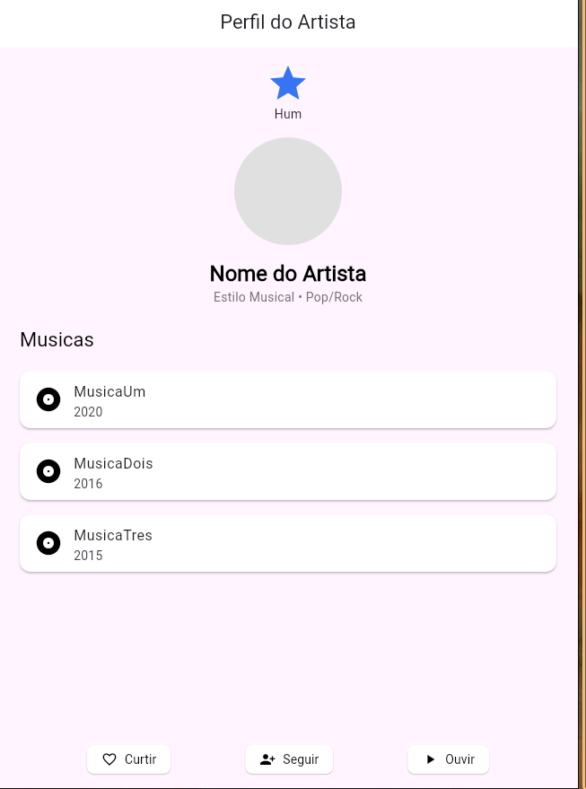

## Equipe

- Alexandre Junior Garcia dos Santos
- Lucas Gabriel Novak
- Vitor Roberto Batista Schirmer

## 1. Protótipo 1

**Descrição**: 
Implementação da tela para calcular o IMC do usuário.

**Aplicações**: 
Criação de 2 inputs: Peso e metros, botão de calcular e o container com o resultado do calculo.

**Como usar**:
O código completo está disponível em: [prova01/prototipo01/lib/main.dart](prova01/prototipo01/lib/main.dart)

Segue o a explicação do código do protótipo 1.
```dart
// declarações das funções:
Map<String, dynamic> calcImc(double peso, double altura) {
  final double imc = peso / (altura * altura);
  String classificacao;
  if (imc < 16.5) {
    classificacao = 'Muito magro';
  } else if (imc < 18.5) {
    classificacao = 'Magro';
  } else if (imc < 25.0) {
    classificacao = 'Normal';
  } else if (imc < 30.0) {
    classificacao = 'Sobrepeso';
  } else {
    classificacao = 'Obeso';
  }
  return {'valor': imc, 'classificacao': classificacao};
}

void _onCalcular() {
  final double peso = double.tryParse(_pesoController.text.replaceAll(',', '.')) ?? 0;
  final double altura = double.tryParse(_alturaController.text.replaceAll(',', '.')) ?? 0;
  final imcData = calcImc(peso, altura);
  setState(() {
    _resultado = 'IMC: ${imcData['valor'].toStringAsFixed(2)} '
        '(${imcData['classificacao']})';
  });
}

// Agrupa-se em coluna os seguintes componentes:
// 1. TextField: Peso (kg)
// 2. SizedBox: Container vazio para criar espaçamento entre os componentes.
// 3. TextField: Altura (m)
// 4. SizedBox: Container vazio para criar espaçamento entre os componentes.
// 5. Text: texto resultado
Column(
      children: [
        TextField(
          controller: _pesoController,
          keyboardType: TextInputType.numberWithOptions(decimal: true),
          decoration: const InputDecoration(
            labelText: 'Peso (kg)', border: OutlineInputBorder(),
          ),
        ),
        const SizedBox(height: 16),
        TextField(
          controller: _alturaController,
          keyboardType: TextInputType.numberWithOptions(decimal: true),
          decoration: const InputDecoration(
            labelText: 'Altura (m)', border: OutlineInputBorder(),
          ),
        ),
        const SizedBox(height: 24),
        Text(
          _resultado,
          style: Theme.of(context).textTheme.headlineMedium,
        ),
      ],
)  

// Insere um botão na barra de navegação inferior.
// Ao clicar no botão, o evento onPressed é disparado executando a função `onCalcular`
bottomNavigationBar: Padding(
  padding: const EdgeInsets.all(16),
  child: ElevatedButton(
    onPressed: _onCalcular,
    child: const Text('CALCULAR IMC'),
  ),
)
```

**Resultado**:


## 2. Protótipo 2

**Descrição**: 
Implementação da tela do artista de música.

**Aplicações**: 
Implementação dos componentes de UI: Icon, foto de perfil, texto com o nome do artista, texto com o gênero musical, lista de músicas e botões no footer da página.

**Como usar**:
O código completo está disponível em: [prova01/prototipo02/lib/main.dart](prova01/prototipo01/lib/main.dart)

```dart
class PerfilArtistaPage extends StatefulWidget {
  const PerfilArtistaPage({super.key});

  @override
  State<PerfilArtistaPage> createState() => _PerfilArtistaPageState();
}

class _PerfilArtistaPageState extends State<PerfilArtistaPage> {
  bool curtido = false;
  bool seguindo = false;

  void _toggleCurtir() {
    setState(() => curtido = !curtido);
  }

  void _toggleSeguir() {
    setState(() => seguindo = !seguindo);
  }

  void _ouvirAgora() {
    ScaffoldMessenger.of(context).showSnackBar(
      const SnackBar(content: Text('🎵 Tocando agora...')),
    );
  }

  // Método principal que constrói a interface da tela.
  // Retorna um widget Scaffold, que fornece a estrutura básica de uma tela Material Design.
  @override
  Widget build(BuildContext context) {
    const spacing = SizedBox(height: 16);

    // Retorna um Scaffold, que organiza a tela com uma barra superior, corpo e barra inferior.
    return Scaffold(
      appBar: AppBar(
        // Título da barra, exibindo "Perfil do Artista".
        title: const Text('Perfil do Artista'),
        // Centraliza o título na AppBar.
        centerTitle: true,
        // Define a cor de fundo da AppBar como branca, garantindo um visual limpo.
        backgroundColor: Colors.white,
      ),
      // Define o corpo da tela, que contém todos os elementos visuais principais.
      body: Padding(
        padding: const EdgeInsets.symmetric(horizontal: 24, vertical: 16),
        // Usa uma Column para organizar os elementos verticalmente.
        child: Column(
          crossAxisAlignment: CrossAxisAlignment.start,
          children: [
            const Center(
              child: Icon(
                Icons.star, 
                size: 48,
                color: Colors.blue, 
              ),
            ),
            const Center(
              child: Text('Hum'),
            ),
            spacing,
            Center(
              child: CircleAvatar(
                radius: 60, 
                backgroundColor: Colors.grey[300], 
                backgroundImage: const AssetImage('assets/imagens/artista.png'),
              ),
            ),
            spacing,
            Center(
              child: Text(
                'Nome do Artista',
                style: Theme.of(context).textTheme.headlineSmall?.copyWith(
                  fontWeight: FontWeight.bold, 
                  color: Colors.black, 
                ),
              ),
            ),
            // Informações sobre o estilo musical do artista, centralizado.
            Center(
              child: Text(
                'Estilo Musical • Pop/Rock', 
                style: Theme.of(context).textTheme.bodyMedium?.copyWith(
                  color: Colors.grey[600], // Cinza claro para menor destaque.
                ),
              ),
            ),
            const SizedBox(height: 24),
            // Título da seção de músicas, alinhado à esquerda.
            Text(
              'Musicas', // Título da lista de músicas.
              // Estilo baseado no tema (titleLarge), com cor preta.
              style: Theme.of(context).textTheme.titleLarge?.copyWith(
                color: Colors.black,
              ),
            ),
            const SizedBox(height: 12),
            // Lista expansível que ocupa o espaço restante da tela.
            Expanded(
              child: ListView(
                children: const [
                  // Primeiro cartão de música.
                  Card(
                    margin: EdgeInsets.symmetric(vertical: 8),
                    elevation: 2,
                    color: Colors.white,
                    shape: RoundedRectangleBorder(
                      borderRadius: BorderRadius.all(Radius.circular(12)),
                    ),
                    // Conteúdo do cartão, usando ListTile para layout padrão.
                    child: ListTile(
                      leading: Icon(
                        Icons.album,
                        size: 32, 
                        color: Colors.black, 
                      ),
                      title: Text('MusicaUm'),
                      subtitle: Text('2020'),
                    ),
                  ),
                  // Segundo cartão de música, com estrutura idêntica ao primeiro.
                  Card(
                    margin: EdgeInsets.symmetric(vertical: 8),
                    elevation: 2,
                    color: Colors.white,
                    shape: RoundedRectangleBorder(
                      borderRadius: BorderRadius.all(Radius.circular(12)),
                    ),
                    child: ListTile(
                      leading: Icon(
                        Icons.album,
                        size: 32,
                        color: Colors.black,
                      ),
                      title: Text('MusicaDois'),
                      subtitle: Text('2016'),
                    ),
                  ),
                  // Terceiro cartão de música, com estrutura idêntica.
                  Card(
                    margin: EdgeInsets.symmetric(vertical: 8),
                    elevation: 2,
                    color: Colors.white,
                    shape: RoundedRectangleBorder(
                      borderRadius: BorderRadius.all(Radius.circular(12)),
                    ),
                    child: ListTile(
                      leading: Icon(
                        Icons.album,
                        size: 32,
                        color: Colors.black,
                      ),
                      title: Text('MusicaTres'),
                      subtitle: Text('2015'),
                    ),
                  ),
                ],
              ),
            ),
          ],
        ),
      ),
      // Barra inferior que contém os botões de interação.
      bottomNavigationBar: Padding(
        padding: const EdgeInsets.all(16),
        child: Row(
          mainAxisAlignment: MainAxisAlignment.spaceEvenly,
          children: [
            ElevatedButton.icon(
              // Chama a função _toggleCurtir ao clicar.
              onPressed: _toggleCurtir,
              icon: Icon(
                curtido ? Icons.favorite : Icons.favorite_border,
                color: curtido ? Colors.red : Colors.black, // Vermelho se curtido, preto se não.
              ),
              label: Text(curtido ? 'Curtido' : 'Curtir'),
              style: ElevatedButton.styleFrom(
                // Borda arredondada para visual moderno.
                shape: RoundedRectangleBorder(
                  borderRadius: BorderRadius.circular(8),
                ),
                padding: const EdgeInsets.symmetric(horizontal: 16, vertical: 12),
                backgroundColor: Colors.white,
                foregroundColor: Colors.black,
              ),
            ),
            // Botão para seguir/deixar de seguir o artista.
            ElevatedButton.icon(
              // Chama a função _toggleSeguir ao clicar.
              onPressed: _toggleSeguir,
              icon: Icon(
                seguindo ? Icons.check : Icons.person_add_alt_1,
                color: seguindo ? Colors.green : Colors.black, // Verde se seguindo, preto se não.
              ),
              label: Text(seguindo ? 'Seguindo' : 'Seguir'),
              style: ElevatedButton.styleFrom(
                shape: RoundedRectangleBorder(
                  borderRadius: BorderRadius.circular(8),
                ),
                padding: const EdgeInsets.symmetric(horizontal: 16, vertical: 12),
                backgroundColor: Colors.white,
                foregroundColor: Colors.black,
              ),
            ),
            // Botão para ouvir música.
            ElevatedButton.icon(
              // Chama a função _ouvirAgora ao clicar.
              onPressed: _ouvirAgora,
              icon: const Icon(
                Icons.play_arrow,
                color: Colors.black,
              ),
              label: const Text('Ouvir'),
              style: ElevatedButton.styleFrom(
                shape: RoundedRectangleBorder(
                  borderRadius: BorderRadius.circular(8),
                ),
                padding: const EdgeInsets.symmetric(horizontal: 16, vertical: 12),
                backgroundColor: Colors.white,
                foregroundColor: Colors.black,
              ),
            ),
          ],
        ),
      ),
    );
  }
}
```

**Resultado**:


